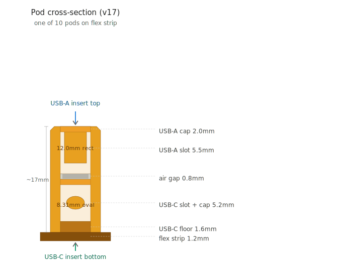
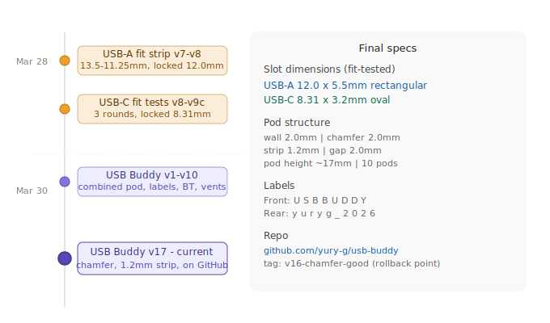

# USB BUDDY

A 3D-printable combined USB-A + USB-C cable organizer strip.

10 pods on a compliant flex strip. USB-A inserts from the **top**, USB-C from the **bottom**. Prints flat, used standing upright.

## Pod cross-section



## Version timeline



## Design features
- 10 pods, each holding one USB-A and one USB-C cable
- 2mm chamfered vertical edges
- Front face: **USBBUDDY** (one letter per pod)
- Rear face: **yuryg 2026** (maker mark)
- End pods labeled with connector type and direction
- 1.2mm flex strip base, 2.0mm gaps between pods
- Internal air separation between USB-A and USB-C zones
- USB slots are the only airflow (no separate vents)

## Slot dimensions (locked from physical fit testing)
| Connector | Width | Height | Shape |
|---|---|---|---|
| USB-A | 12.0mm | 5.5mm | Rectangle |
| USB-C | 8.31mm | 3.2mm | Oval |

## Files
- `usb_buddy.scad` Ñ OpenSCAD source (v17)
- `usb_buddy.stl` Ñ Latest print-ready STL
- `HANDOFF.md` Ñ Full session notes for next Claude session
- `docs/` Ñ SVG diagrams

## All STLs this session

### USB-A fit test strip
| File | Description | Date |
|---|---|---|
| `usba_cable_holder_v8final.stl` | Graduated slots 13.5?11.25mm | Mar 28, 2026 15:34 |
| `usba_cable_holder_v8_2026-03-28.stl` | Locked 12.0mm Ñ production final | Mar 28, 2026 15:35 |

### USB-C fit test strips
| File | Description | Date |
|---|---|---|
| `usbc_fittest_8.65-7.30mm_v8_2026-03-28.stl` | Round 1 Ñ 0.15mm steps | Mar 28, 2026 15:40 |
| `usbc_fittest_8.55-8.10mm_v9_2026-03-28.stl` | Round 2 Ñ 0.05mm steps | Mar 28, 2026 17:20 |
| `usbc_fittest_8.55-8.10mm_v9b_2026-03-28.stl` | v9b Ñ open top restored | Mar 28, 2026 17:23 |
| `usbc_fittest_8.45-8.27mm_v9c_2026-03-28.stl` | Round 3 Ñ 0.02mm steps | Mar 28, 2026 17:25 |
| `usbc_holder_8.31mm_v10final_2026-03-28.stl` | Locked 8.31mm Ñ production final | Mar 28, 2026 19:18 |

### USB Buddy combined
| File | Description | Date |
|---|---|---|
| `usb_buddy_v13_2026-03-30.stl` | Combined pod, clean rear | Mar 30, 2026 14:45 |
| `usb_buddy_v16_2mm_chamfer_2026-03-30.stl` | 2mm chamfer added | Mar 30, 2026 14:52 |
| `usb_buddy.stl` | v17 Ñ 1.2mm strip, 2mm gaps Ñ **current** | Mar 30, 2026 14:59 |

## Print settings
- Material: PLA
- Layer height: 0.2mm
- Infill: 20%+
- Supports: None needed
- Orientation: Flat on bed

## How to render
```bash
/Applications/OpenSCAD.app/Contents/MacOS/OpenSCAD --render -o usb_buddy.stl usb_buddy.scad
```

## By
yury-g Ñ 2026
