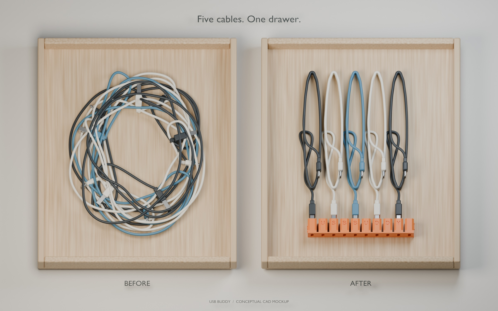
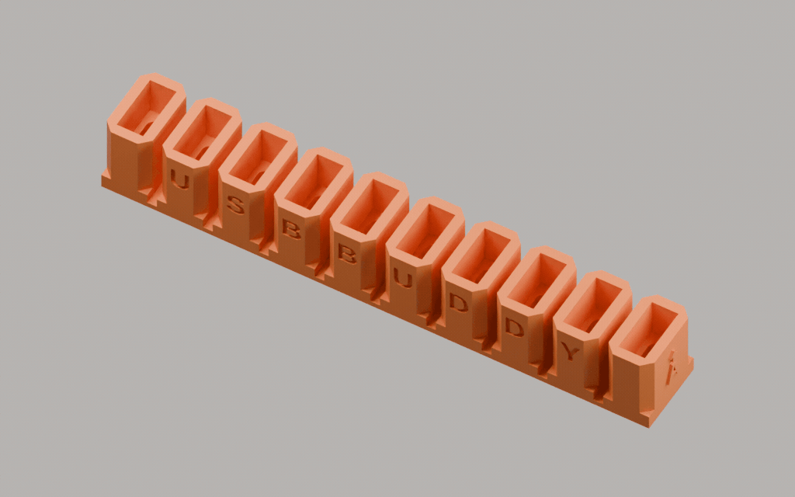

# USB BUDDY

### A little order for your everyday cables.

**One-piece print · No assembly · Designed for support-free printing**

[**Download USB Buddy v18 →**](https://github.com/yury-g/usb-buddy/raw/refs/heads/main/usb_buddy_v18.stl) · [See it from every side](#a-small-design-from-every-angle) · [Edit the design](usb_buddy.scad)

The charging cable. The camera cable. The one you always have to untangle first.

USB Buddy gives their loose ends a place to land. Ten small pods hold USB-A connectors from above and USB-C connectors from below. Loop both ends of a cable into one pod, park different cables side by side, or mix the two. It's a small, useful thing you can print in a color you like.

## Two openings. One simple idea.

| USB-A goes in above | USB-C goes in below |
| :---: | :---: |
|  |  |
| Park the familiar rectangular end in the top of a pod. | Park the smaller oval end underneath the same pod. |

The raised **A ↑** and **C ↓** markings live on the outer ends, keeping the recessed **USB BUDDY** lettering clear across the front.

## Your cables don't all have to match.

Four cables loop back into their own pods. The rest of the strip holds a mix of everyday cables, including ones with micro-USB on the loose end. A couple of pods share space between two separate cables.

**The holder grips USB-A and USB-C ends.** A cable with micro-USB at its other end parks by its USB-A end; there's no dedicated micro-USB slot.

<strong>Explore both ways to fill the strip</strong>

| Both ends of the same cable | Both ends of ten cables |
| :---: | :---: |
|  |  |

| Two different cables share a pod | Twenty cables share ten pods |
| :---: | :---: |
|  |  |

<strong>Look inside a pod</strong>

The cutaway shows the stepped interior and the two parked connector tips. Their exact seating depth depends on your cables and print fit. USB Buddy is a passive holder: it does not electrically connect the plugs, charge devices or transfer data.

## A calmer cable drawer.

A few loose coils, the connector ends in one place, and a little less rummaging. This before-and-after is a conceptual CAD mockup using the real organizer geometry.

## A small design, from every angle.

The animation uses the same v18 mesh as the download. **[Watch the MP4](docs/images/usb-buddy-orbit.mp4)** · [See a still view](docs/images/product-orange.jpg)

Ten chamfered pods. A thin connecting strip. Raised directions at the ends. Nothing to put together after printing.

## Make it feel at home.

| Tangerine / soft studio light | Sage / soft studio light | Graphite / cool edge light |
| :---: | :---: | :---: |
|  |  |  |

Choose a quiet color for your desk, or something bright enough to spot in a drawer.

Product, mechanism, drawer and animation views are CAD renders. Cable models illustrate the storage arrangements, not physical fit-test results. The two tabletop lifestyle scenes are AI-generated visualizations based on the CAD renders. Colors are filament suggestions.

## Print it. Loop it. Park it.

**[Download the current v18 STL](https://github.com/yury-g/usb-buddy/raw/refs/heads/main/usb_buddy_v18.stl)**

**Prints in one piece. No assembly or extra hardware. Designed for support-free printing.**

| Setting | Starting point |
| :--- | :--- |
| Material | PLA |
| Layer height | 0.2 mm |
| Infill | 20% or more |
| Orientation | Continuous flat strip on the bed |
| Supports | Off |
| Brim / raft | Not used in the reference slice |
| Overall size | 114.2 × 16 × 16.3 mm, including raised end labels |

The v18 mesh is one connected, closed part. It has been computationally sliced with supports, brim and raft disabled. **The new raised labels still await a physical print check.** See the [validation notes](docs/verification.md) for the tested settings and slicer limitations.

The original project records report fit testing for the **12.0 × 5.5 mm USB-A opening** and **8.31 × 3.2 mm USB-C opening**. Those interiors are unchanged in v18. Check your own cables and printer tolerances; the thin PLA base is intended for gentle flex, not tight bends.

## Files for making—and making it yours.

| File | What's inside |
| :--- | :--- |
| [usb_buddy_v18.stl](usb_buddy_v18.stl) | Current v18 download, with matching raised labels on the outer ends |
| [usb_buddy.stl](usb_buddy.stl) | Latest-model alias; currently identical to v18 |
| [usb_buddy.scad](usb_buddy.scad) | Editable OpenSCAD design |
| [Cable scenes](docs/models/usb-buddy-cable-scenes.blend) | Reusable USB-A/USB-C models and the four storage arrangements |
| [Detail and mixed-load scenes](docs/models/usb-buddy-details.blend) | Insertion close-ups, micro-USB loose ends and the mixed cable display |
| [Rendering guide](docs/render/README.md) | Reproduce the visuals |
| [Design notes](HANDOFF.md) | Current dimensions and print checks |
| [v17 model](usb_buddy_v17.stl) · [Earlier notes](docs/archive/README-v17.md) | Previous revision and development history |

Designed by [Yury Gitman](https://github.com/yury-g) · 2026
