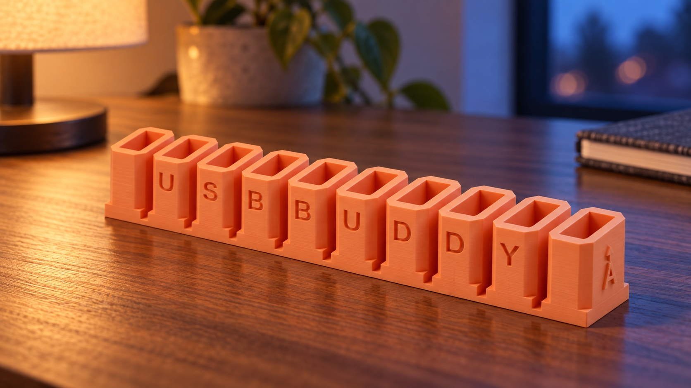
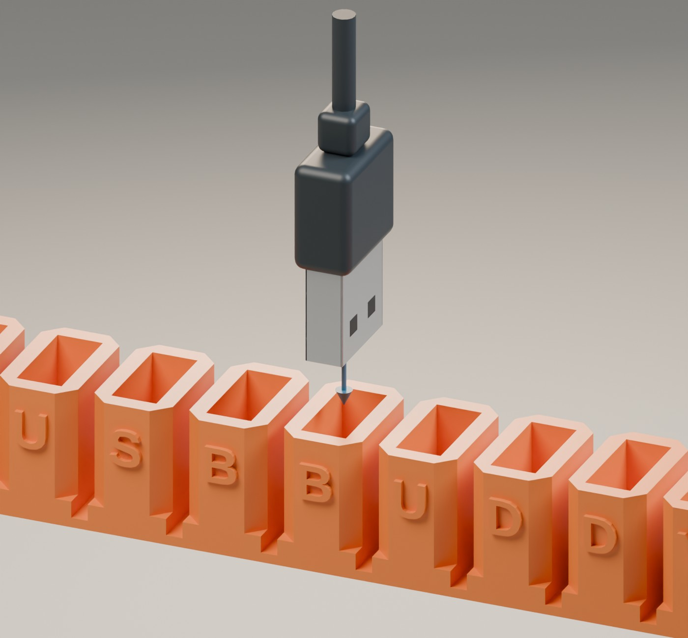
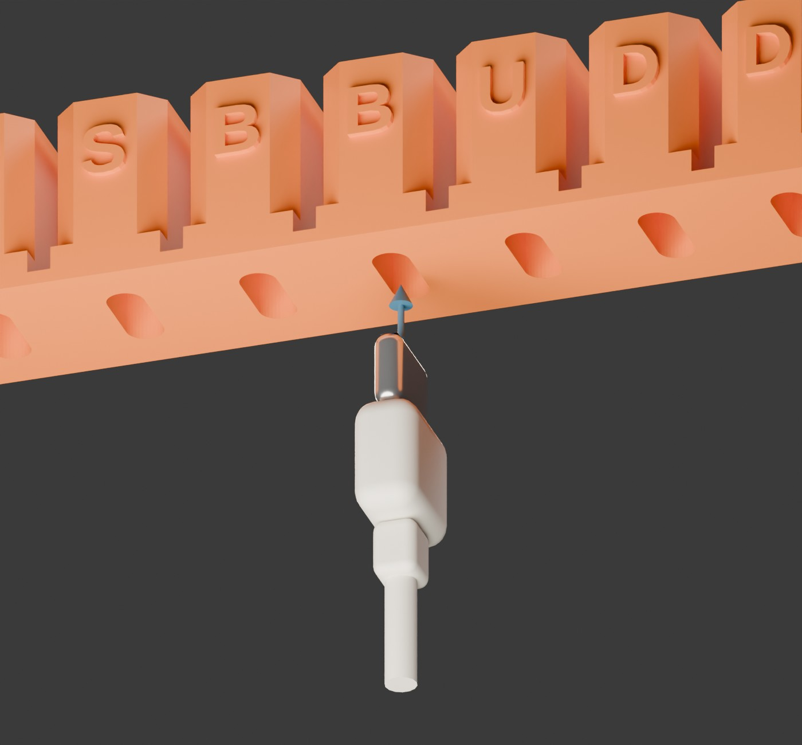
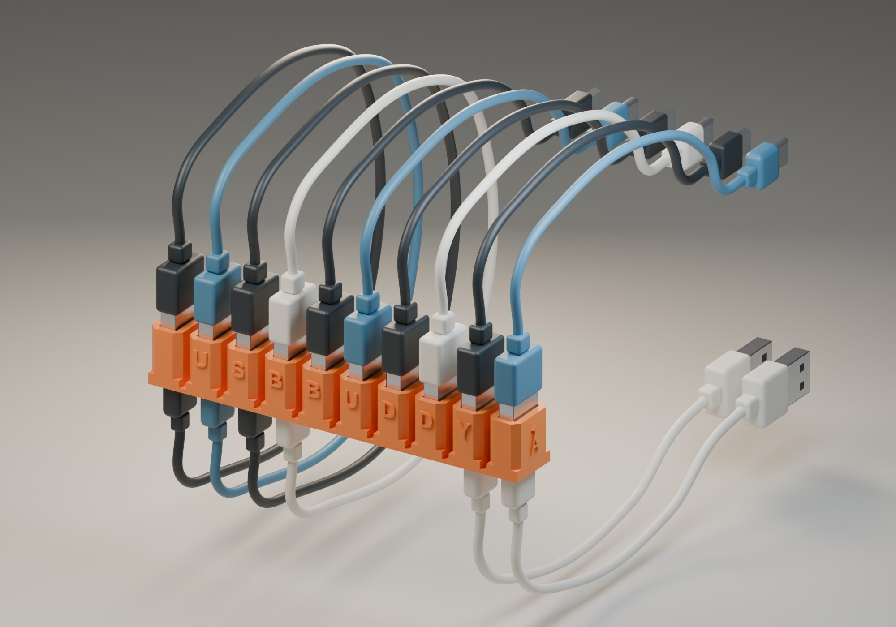

# USB BUDDY

### A little order for your everyday cables.

**One-piece print · No assembly · Designed for support-free printing**

[**Download USB Buddy v18 →**](https://github.com/yury-g/usb-buddy/raw/refs/heads/main/usb_buddy_v18.stl) · [Edit the design](usb_buddy.scad)

Give your loose cable ends a place to land. USB Buddy has ten pods for USB-A and USB-C connectors. Loop both ends of a cable into one pod, park different cables side by side, or mix the two.

## Two openings. One simple idea.

| USB-A goes in above | USB-C goes in below |
| :---: | :---: |
|  |  |
| Park the familiar rectangular end in the top of a pod. | Park the smaller oval end underneath the same pod. |

## Your cables don't all have to match.

Four cables loop back into their own pods. The rest of the strip holds a mix of everyday cables, including ones with micro-USB on the loose end. A couple of pods share space between two separate cables.

**The holder grips USB-A and USB-C ends.** A cable with micro-USB at its other end parks by its USB-A end; there's no dedicated micro-USB slot.

A small home for the cables you reach for every day.

Connector views are CAD renders with illustrative cables. Tabletop scenes are AI-generated visualizations based on the design.

## Print it. Loop it. Park it.

**[Download the current v18 STL](https://github.com/yury-g/usb-buddy/raw/refs/heads/main/usb_buddy_v18.stl)**

| Setting | Starting point |
| :--- | :--- |
| Material | PLA |
| Layer height | 0.2 mm |
| Infill | 20% or more |
| Orientation | Continuous flat strip on the bed |
| Supports | Off |
| Brim / raft | Not used in the reference slice |
| Overall size | 114.2 × 16 × 16.3 mm, including raised end labels |

The one-piece v18 model has been sliced with supports, brim and raft disabled. **The raised end labels still await a physical print check.** Connector fit depends on your cables and printer tolerances. USB Buddy is a storage holder; it does not charge or connect devices.

[Print checks and dimensions](docs/verification.md) · [Editable OpenSCAD source](usb_buddy.scad) · [Design notes](HANDOFF.md) · [Rendering files](docs/render/README.md)

Designed by [Yury Gitman](https://github.com/yury-g) · 2026
