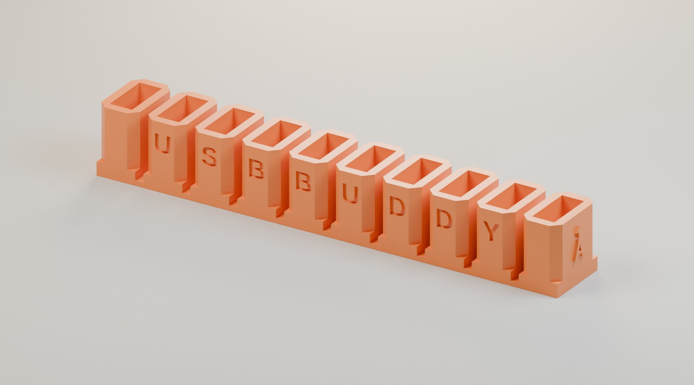
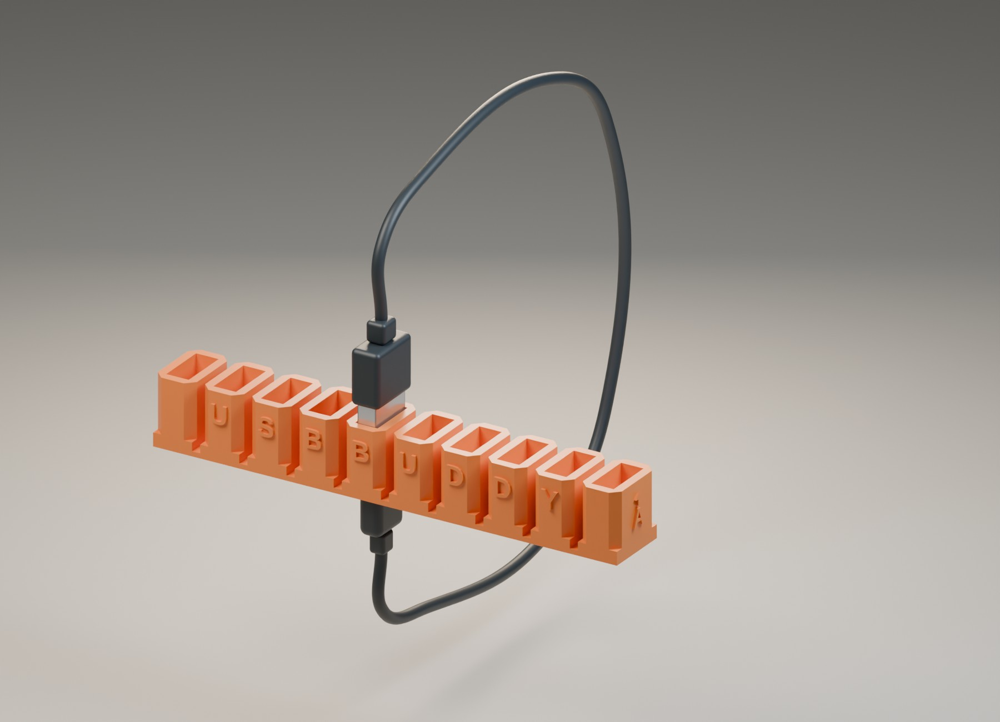
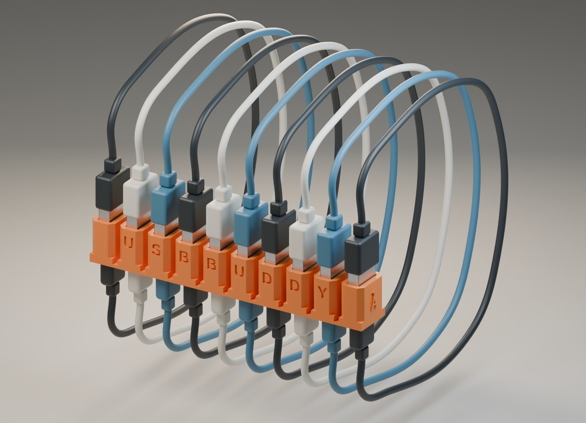
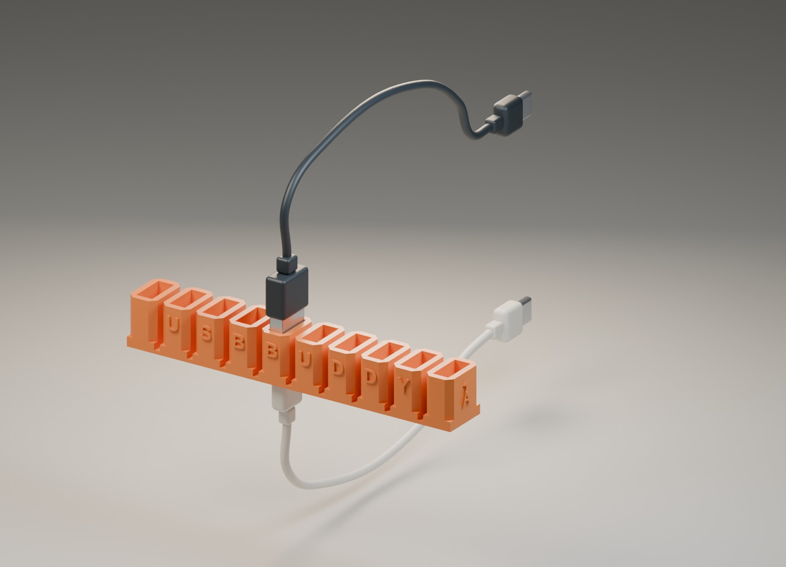
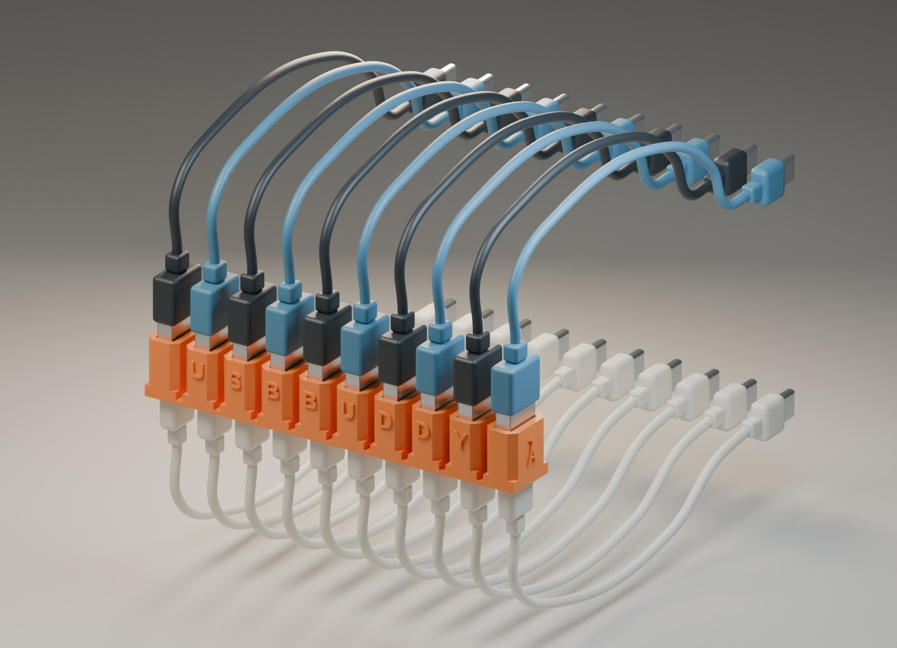
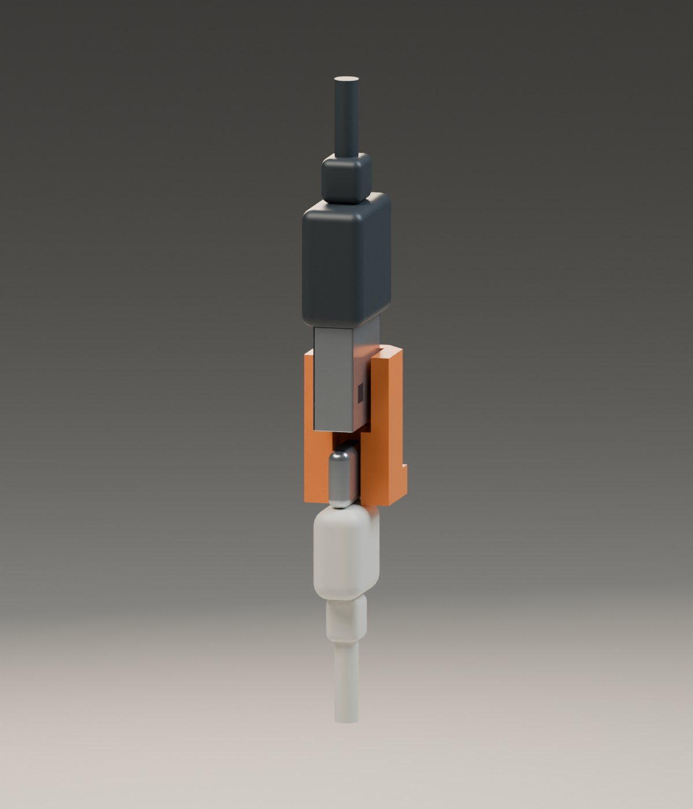
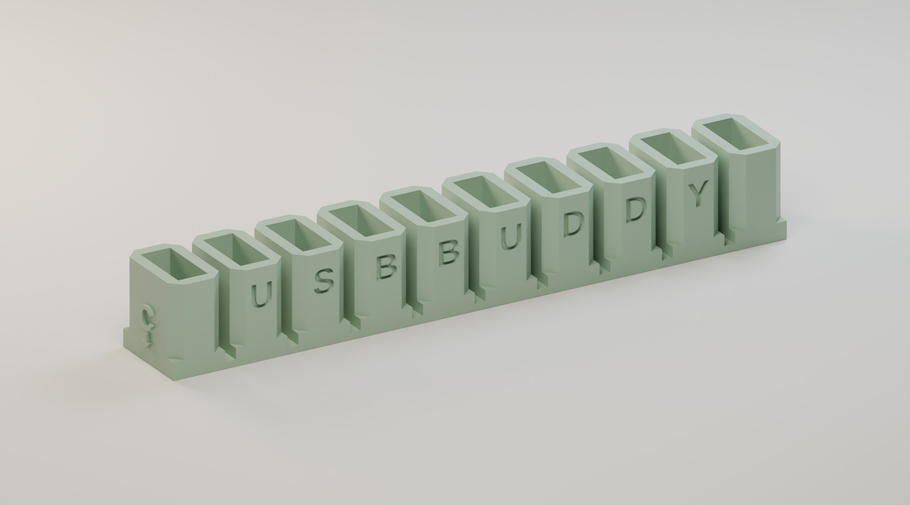
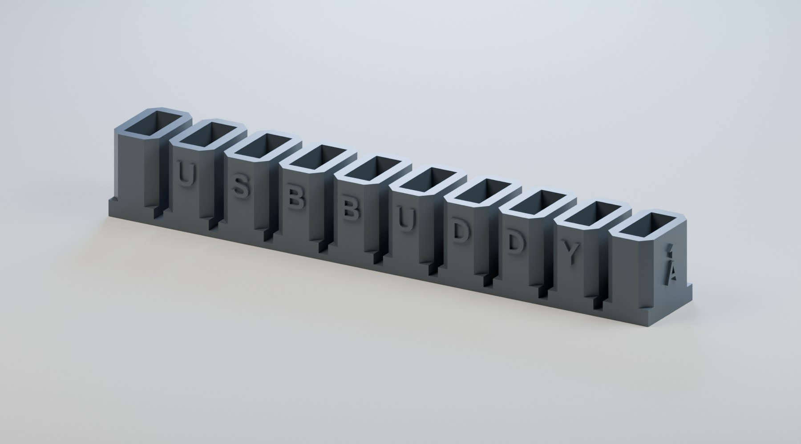
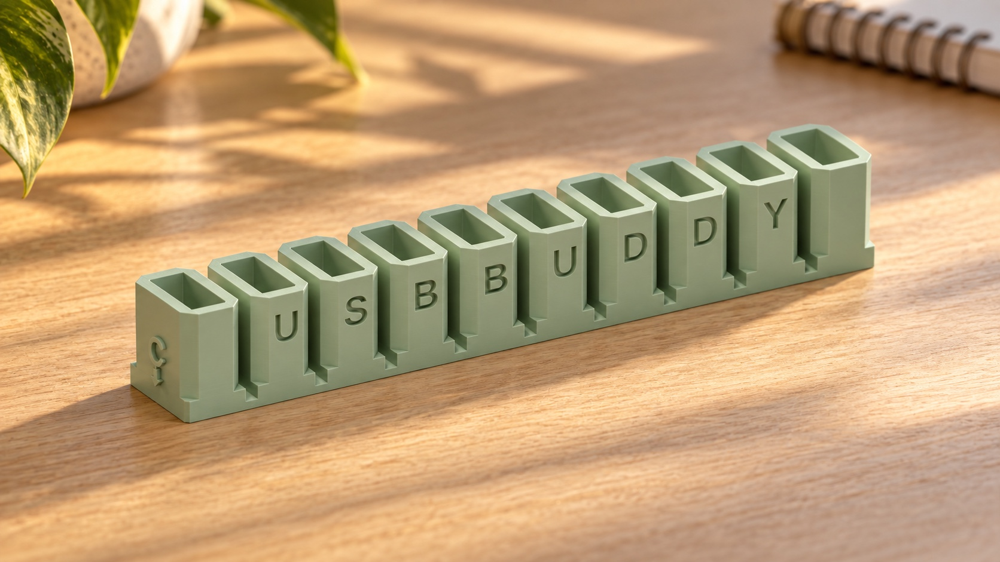

# USB BUDDY

### A little home for every cable end.

**10 pods · USB-A + USB-C · One printable piece**

[Download the STL](https://github.com/yury-g/usb-buddy/raw/refs/heads/main/usb_buddy.stl) · [Explore the design](usb_buddy.scad) · [Get the cable models](docs/models/usb-buddy-cable-scenes.blend)

Loose ends deserve a place to land. **USB Buddy** parks USB-A and USB-C connectors in a compact, 3D-printable strip. Each pod accepts an A end from above and a C end from below—so you can keep both ends of one cable together, or give two different cables a shared parking spot.

Print it. Loop it. Park it.

## One cable. Both ends. Same pod.

Take a USB-A–to–USB-C cable. Insert its A end into the rectangular opening and its C end into the oval opening underneath. The cable loops back to the same pod, with both ends accounted for.

| Start with one | Fill the strip |
| :---: | :---: |
|  |  |
| **1 cable · 1 pod · both ends parked** | **10 cables · 10 pods · 20 ends parked** |

## Or share a pod between two cables.

An A end from one cable goes in above. A C end from a second cable goes in below. Follow the dark and light cables in these renders: they stay separate, with their other ends free.

| Two cables, one pod | Every pod occupied |
| :---: | :---: |
|  |  |
| **2 separate cables · 1 pod** | **20 separate cables · 10 pods** |

USB Buddy is a passive storage holder. The connectors park inside it; it provides no electrical connection, charging or data transfer.

<strong>Look inside one pod</strong>

  

The front half of one pod is removed here to expose the connector positions. The A and C openings form a stepped internal passage. The illustrated tips stop short of each other; the precise seating depth depends on your cables and print fit. This is storage, not an adapter.

## Small details. Plenty of character.

- **A clean front.** Recessed “USB BUDDY” lettering spans the middle eight pods.
- **Directions at the ends.** Matching raised A/C letters and arrows sit on the two outer end faces, out of the wordmark's way.
- **A connected strip.** Ten pods share a 1.2 mm base, with 2 mm gaps between them.
- **Chamfered corners.** 2 mm chamfers give the pods their distinctive shape.
- **Your filament, your color.** A small object can still feel at home on your desk.

| Tangerine / soft studio light | Sage / soft studio light | Graphite / cool edge light |
| :---: | :---: | :---: |
|  |  |  |

Studio and cable views are rendered from the v18 printable mesh. Cable models illustrate the storage arrangements and are not physical fit-test results. The desk scene is an AI-generated lifestyle visualization based on the CAD render; colors are filament suggestions.

## Make your own

**[Download USB Buddy v18](https://github.com/yury-g/usb-buddy/raw/refs/heads/main/usb_buddy.stl)** and open it in your slicer. The source is editable in [OpenSCAD](usb_buddy.scad).

| Setting | Starting point |
| :--- | :--- |
| Material | PLA |
| Layer height | 0.2 mm |
| Infill | 20% or more |
| Orientation | Continuous flat strip on the bed |
| Supports | Start without supports; inspect the small raised end labels in your slicer |
| Overall size | 114.2 × 16 × 16.3 mm, including the raised end labels |

**Current revision: v18.** This moves the connector markings to the ends with 0.6 mm relief. The connector interiors are unchanged from v17; the updated mesh passes the OpenSCAD manifold check. The new labels still need a physical print check. The [previous v17 STL](usb_buddy_v17.stl) remains available.

The project records report physical fit testing for the original **12.0 × 5.5 mm USB-A opening** and **8.31 × 3.2 mm USB-C opening**. Cable housings and printer tolerances vary, so check your own fit before loading the strip. The thin PLA base is intended to flex slightly; avoid forcing tight bends.

## Inside the project

| File | What's inside |
| :--- | :--- |
| [usb_buddy.stl](usb_buddy.stl) | Current v18 printable model |
| [usb_buddy.scad](usb_buddy.scad) | Parametric design source |
| [Cable scene models](docs/models/usb-buddy-cable-scenes.blend) | Editable USB-A/USB-C plugs, continuous cable curves, four storage scenes, cutaway and color views |
| [Rendering guide](docs/render/README.md) | Reproduce the images and verify the revised geometry |
| [Current design notes](HANDOFF.md) | Dimensions, validation and remaining print checks |
| [Earlier project notes](docs/archive/README-v17.md) | Original development timeline and fit-test file history |

Designed by [Yury Gitman](https://github.com/yury-g) · 2026
